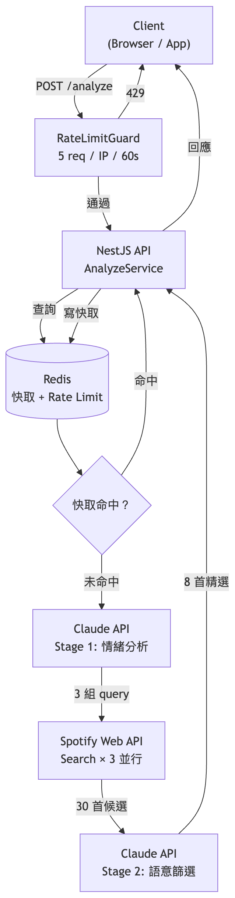
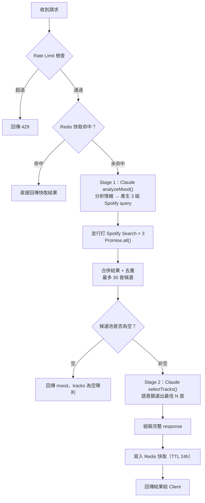

# VibeTrack

> 輸入文字或圖片，AI 分析情緒氛圍，Spotify 推薦最對味的歌曲。

[](https://nodejs.org/)
[](https://nestjs.com/)
[](https://www.typescriptlang.org/)
[](https://redis.io/)
[](LICENSE)

---

## 專案簡介

VibeTrack 是一個以 AI 驅動的音樂推薦 REST API。使用者提供文字描述或圖片，後端呼叫 Claude AI 分析輸入所傳達的情緒氛圍，接著在 Spotify 上搜尋候選歌曲，最後再次透過 Claude 語意篩選出 8 首最符合當下心境的歌曲。

本專案作為求職 portfolio 展示，重點在於：
- **兩階段 Claude AI 整合**設計（情緒分析 → 語意篩選）
- 多路並行 Spotify 搜尋 + 去重合併，繞過單次搜尋數量限制
- Redis 快取 + Rate Limiting 的 production-ready 後端架構

---

## 系統架構

1. **RateLimitGuard** — 每個 IP 每 60 秒最多 5 次，超過回傳 429
2. **Redis 快取檢查** — 命中直接回傳；未命中繼續往下
3. **Claude Stage 1** — 分析情緒，產生 3 組 Spotify 搜尋 query
4. **Spotify Search × 3** — 並行搜尋，合併去重，最多 30 首候選
5. **Claude Stage 2** — 語意篩選出最符合情緒的 N 首歌
6. **寫入 Redis** — 結果快取 24 小時，相同輸入下次直接命中



---

## 技術選型

| 技術 | 版本 | 選擇原因 |
|------|------|----------|
| **NestJS** | 11 | 模組化架構清晰，IoC 容器讓依賴注入和測試更簡潔，TypeScript 原生支援 |
| **Claude API** | claude-sonnet-4-5 | Vision + 文字同時支援，結構化 JSON 輸出穩定，適合兩階段 AI pipeline |
| **Spotify Web API** | — | 音樂資料來源，Search API 支援關鍵字搜尋，回傳豐富 metadata |
| **Redis (ioredis)** | 5 | 快取相同輸入降低 API 費用；固定視窗 Rate Limiting 計數器 |
| **Winston** | 3 | 結構化日誌，支援 correlation ID 追蹤每筆請求完整生命週期 |
| **Joi** | 18 | 啟動時驗證環境變數，缺少必要設定則拒絕啟動，避免 runtime 錯誤 |

---

## 技術挑戰與解決方式

### 1. Spotify `/audio-features` 端點對新 App 回傳 403

Spotify 新版 API 限制，一般開發者 App 無法存取 `/audio-features`，原本打算用 danceability、energy、valence 等音訊特徵數值排序候選歌曲的方案因此失效。

**解法：** 改由 Claude Stage 2 直接對候選歌曲清單做語意理解與篩選，根據情緒描述和歌曲名稱、歌手風格做主觀判斷，反而比純數值排序更靈活，能捕捉歌詞意境與文化脈絡。

### 2. Spotify Search `limit` 最大為 10，候選池過小

單次搜尋最多只能取回 10 首，候選池太小則 Claude 無從比較，篩選品質偏低。

**解法：** Stage 1 Claude 產生 3 組不同角度的搜尋 query，後端以 `Promise.all()` 並行打出 3 次搜尋，合併後以 track ID 去重，候選池擴大到最多 30 首，再交給 Claude Stage 2 篩選。

### 3. Spotify 移除 `popularity` 欄位（開發模式）

開發模式下 Spotify API 回傳的 `popularity` 為 null，無法用來排除冷門歌曲，偶爾會推薦到幾乎無人知曉的版本。

**解法：** 在 Claude Stage 2 的 prompt 中明確要求：「當情緒契合度相當時，優先選擇知名度較高的歌曲」，讓語言模型利用自身訓練知識做出補償性判斷。

---

## API 文件

完整互動式文件：`GET /api/docs`（Swagger UI）

### `POST /analyze`

分析輸入情緒並推薦音樂。

**Content-Type:** `multipart/form-data`

| 欄位 | 類型 | 必填 | 說明 |
|------|------|------|------|
| `text` | string | text / image 擇一 | 情緒描述文字（最多 300 字） |
| `image` | file | text / image 擇一 | 圖片（JPEG / PNG / WebP / GIF，最大 5 MB） |
| `market` | string | 否 | Spotify 地區代碼，影響歌曲可用性（如 `TW`、`US`） |
| `limit` | number | 否 | 回傳歌曲數量，支援 `5`、`8`、`10`，預設 `8` |

**成功回應 `200`：**

```json
{
  "mood": {
    "label": "Melancholic",
    "sub": "quietly nostalgic",
    "tags": [
      { "name": "Nostalgia", "primary": true },
      { "name": "Longing", "primary": false }
    ]
  },
  "tracks": [
    {
      "id": "4uLU6hMCjMI75M1A2tKUQC",
      "title": "Never Let Me Go",
      "artist": "Florence + The Machine",
      "spotify_url": "https://open.spotify.com/track/4uLU6hMCjMI75M1A2tKUQC",
      "preview_url": "https://p.scdn.co/mp3-preview/...",
      "popularity": 72,
      "album_image_url": "https://i.scdn.co/image/...",
      "reason": "空靈的人聲與層疊的樂器聲創造出如水底般的漂浮感，呼應了那份無法言說的思念。"
    }
  ]
}
```

**錯誤回應：**

| 狀態碼 | 情境 |
|--------|------|
| `400` | text 與 image 皆未提供，或圖片格式不符 |
| `429` | 超過 Rate Limit（5 次 / IP / 60 秒） |
| `500` | 上游 API 錯誤 |

**快取：** 相同輸入（MD5 雜湊）直接回傳快取結果，TTL 24 小時。

---

## AI 整合設計

### 兩階段 Claude 呼叫



### 為什麼用兩階段

**Stage 1（情緒分析）** 的 prompt 保持精簡：只要求模型理解輸入、輸出結構化情緒描述與 3 組搜尋 query，不塞入任何候選資料。

**Stage 2（語意篩選）** 的 prompt 則帶入完整 30 首候選歌曲清單，讓模型在有足夠比較基礎的情況下做出判斷。

兩個階段職責單一，prompt 精準，比起把所有工作塞進單一呼叫，輸出穩定性更高。

### Claude 取代 `/audio-features` 的優勢

Spotify 音訊特徵是數值（0.0–1.0），代表 danceability、energy 等維度，本質上是統計特徵，無法理解「這首歌的歌詞在說告別」或「這個歌手以憂鬱英倫風著稱」。Claude 的語意理解可以同時考量歌名、歌手、流派的文化脈絡，在 `/audio-features` 被限制之後，反而讓推薦品質更接近人工策展的質感。

### Prompt 設計原則

- **只回傳 JSON：** system prompt 明確要求不附加任何說明文字，輸出直接可 `JSON.parse()`
- **明確定義欄位格式：** 每個欄位的型別、長度、範圍都在 prompt 中指定，減少模型自由發揮的空間
- **語言偏好直接帶入 prompt：** 推薦理由的語言透過 prompt 指定，無需在後端做二次處理
- **錯誤容忍：** `JSON.parse()` 包在 try/catch，解析失敗時拋出有意義的錯誤訊息而非 500

### Claude Code 輔助開發

本專案的架構設計、技術選型討論、Spotify API 限制的排查與繞過方案、prompt 迭代，皆在 Claude Code 的協作下完成。Claude Code 在 NestJS module wiring、Guard / Interceptor 實作細節，以及 Redis fail-open 錯誤處理策略上提供了具體的程式碼建議。

---

## 本地開發

**前置需求：** Node.js 22+、Redis（本地或 Docker）

```bash
# 安裝依賴
npm install

# 複製環境變數範本
cp .env.example .env

# 填入必要的 API 金鑰（見下方環境變數說明）

# 啟動開發伺服器（watch mode）
npm run start:dev

# 建置 production
npm run build
npm run start:prod

# 執行測試
npm test
npm run test:cov   # 含覆蓋率報告

# Lint + 格式化
npm run lint
npm run format
```

啟動後：
- **API：** `http://localhost:3000/analyze`
- **Swagger 文件：** `http://localhost:3000/api/docs`
- **健康檢查：** `http://localhost:3000/health`

---

## 環境變數

所有變數在啟動時透過 Joi schema 驗證，任一必要變數缺少時服務不會啟動。

| 變數 | 必要 | 說明 |
|------|------|------|
| `CLAUDE_API_KEY` | ✅ | Anthropic API 金鑰 |
| `SPOTIFY_CLIENT_ID` | ✅ | Spotify 應用程式 Client ID |
| `SPOTIFY_CLIENT_SECRET` | ✅ | Spotify 應用程式 Client Secret |
| `REDIS_URL` | ✅ | Redis 連線 URI（如 `redis://localhost:6379`） |
| `PORT` | 預設 `3000` | HTTP 監聽 port |
| `LOG_LEVEL` | 預設 `info` | Winston log 等級（`debug` / `info` / `warn` / `error`） |
| `RATE_LIMIT_MAX` | 預設 `5` | 每個 IP 在視窗時間內最大請求數 |
| `RATE_LIMIT_WINDOW_SEC` | 預設 `60` | Rate limit 視窗秒數（production 建議設為 `3600`） |

Spotify 應用程式可在 [Spotify Developer Dashboard](https://developer.spotify.com/dashboard) 建立。

---

## 部署

本專案部署於 **Render**（Web Service + Redis Add-on）。

- Build 指令：`npm install && npm run build`
- Start 指令：`npm run start:prod`
- 使用 [cron-job.org](https://cron-job.org) 每 10 分鐘 ping `GET /health`，避免 Render 免費方案閒置 15 分鐘後休眠

---

## Future Work

- [ ] JWT 帳號系統與使用者驗證
- [ ] 查詢歷史紀錄（PostgreSQL + Prisma）
- [ ] 個人化推薦（根據歷史喜好調整 prompt）
- [ ] 手機 App（React Native / Flutter）

---

## License

[MIT](LICENSE)
